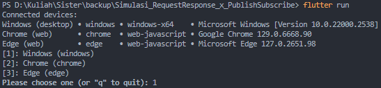
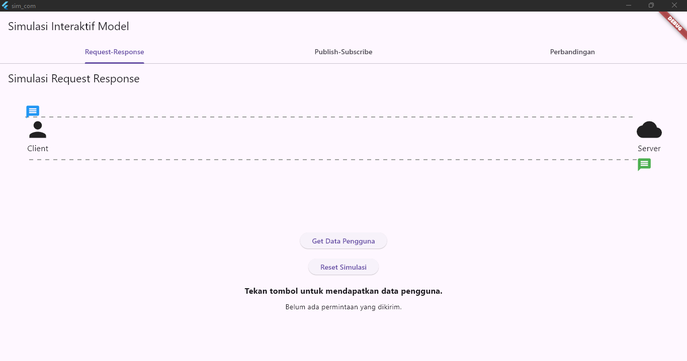
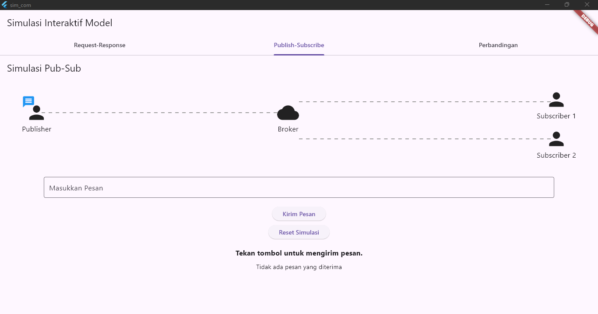
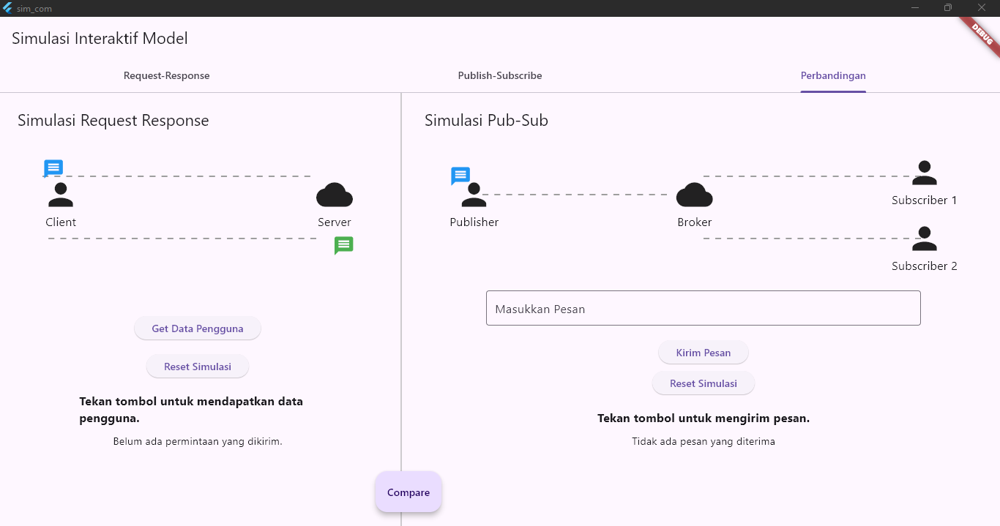

# Simulasi Request Response & Publish Subscribe

Simulasi ini bertujuan untuk memperlihatkan cara kerja sistem Request Response & Publish Subscribe

## Cara Running
<br>

```bash
git clone https://github.com/MInsanKamil/Simulasi_RequestResponse_x_PublishSubscribe.git
```


```bash
cd Simulasi_RequestResponse_x_PublishSubscribe
```

```bash
flutter run
```


Kemudian, pilih windows sebagai platform untuk running simulasi

## Tampilan
<br>

- Tampilan Simulasi Request-Responese

- Tampilan Simulasi Publish-Subscribe

- Tampilan Halaman Perbandingan



